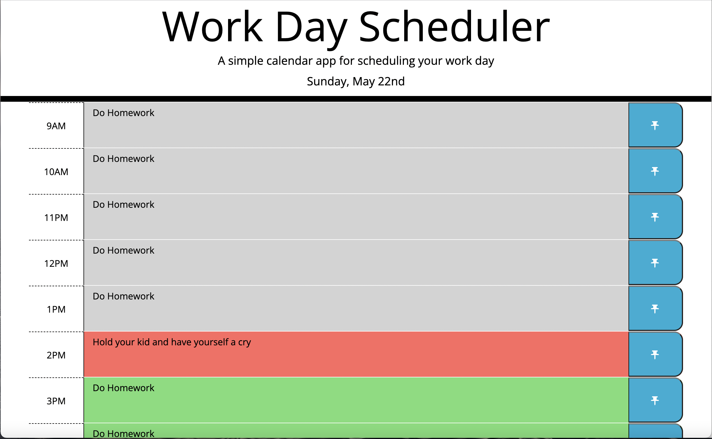

# work-day-scheduler
**A day planner that allows for peristent data**

This site shows a day planner with standard business hours.

The page will display today's date above the calendar.

A user may click on the text field next to any given time and enter new tasks, or appointments.

If the user clicks the pin button next the text field, the entered text will store in local storage and persist on the page whenever the page is reloaded.

The calendar is color coded to reflect the time of day.  The present hour is highlighted red, the past is highlighted gray, and the future is highlighted green.

The site will automatically update itself to keep its color coding current.

https://frodrickfronkenstein.github.io/work-day-scheduler/